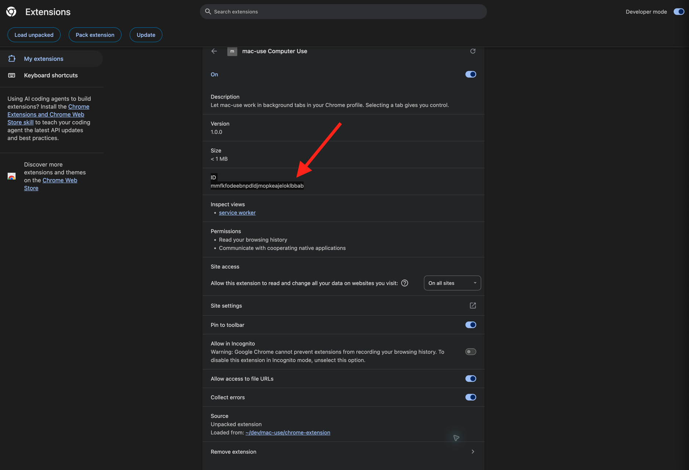

# mac-use (Español)

Read this in: [English](README.md)

### ¿Por qué usar mac-use?

mac-use está diseñado para funcionar junto con tu uso normal del Mac y con otras herramientas de control del ordenador compatibles. En ventanas nativas, actúa mediante Accesibilidad sobre la ventana exacta que eliges, sin activarla ni mover el puntero físico. Espera a que termine la actividad reciente del teclado o del ratón y se detiene si tomas el control. Su bloqueo compartido ordena las acciones junto con otras herramientas que respetan el mismo bloqueo, incluido RemoteCode. No se puede garantizar que no haya conflictos con herramientas que no lo utilizan. En Chrome, mac-use abre pestañas en segundo plano y deja de controlarlas cuando seleccionas una.

### Requisitos

- macOS 14 o posterior
- Xcode Command Line Tools (`xcode-select --install`)
- Un cliente MCP: Distill, Codex, Claude Code o Grok Build
- Google Chrome solo si quieres usar las herramientas del navegador

### 1. Compilar el servidor MCP

Abre Terminal y ejecuta:

```sh
git clone git@github.com:samuelfaj/mac-use.git
cd mac-use
swift build -c release
```

Si no usas SSH de GitHub, cambia el primer comando por la URL que utilizas normalmente. Conserva esta carpeta después de la instalación. Los clientes MCP de abajo inician el mismo ejecutable desde esta carpeta.

### 2. Conectarlo a tu cliente MCP

Ejecuta **un solo** comando, según el cliente que uses, desde la carpeta `mac-use`:

- **Distill:**

  ```sh
  distill mcp add mac-use -- "$(pwd)/.build/release/mac-use-mcp"
  distill mcp doctor mac-use
  ```

- **Codex:**

  ```sh
  codex mcp add mac-use -- "$(pwd)/.build/release/mac-use-mcp"
  ```

- **Claude Code:**

  ```sh
  claude mcp add --scope user mac-use -- "$(pwd)/.build/release/mac-use-mcp"
  ```

- **Grok Build:**

  ```sh
  grok mcp add --scope user mac-use -- "$(pwd)/.build/release/mac-use-mcp"
  ```

Si el cliente ya estaba abierto, reinícialo después de añadir el servidor. En Claude Code, acepta el servidor si aparece una solicitud. Conserva el repositorio en la misma ruta; cada cliente inicia el ejecutable desde allí.

### Instalar la skill del agente globalmente

Instala la [skill mac-use](skills/mac-use/SKILL.md) incluida en este repositorio para Codex, Claude Code y Distill/Grok Build (que comparten `~/.grok/skills`):

```sh
for root in "$HOME/.codex/skills" "$HOME/.claude/skills" "$HOME/.grok/skills"; do
  mkdir -p "$root/mac-use"
  cp "skills/mac-use/SKILL.md" "$root/mac-use/SKILL.md"
done
```

Inicia una sesión nueva del cliente después de instalarla. La skill exige cerrar los recursos creados por el agente incluso ante errores, preservar los recursos del usuario y verificar la limpieza. El MCP también comunica un recordatorio. Son instrucciones para el agente, no un entorno aislado automático; el perfil compartido de Chrome conserva su historial y los datos de los sitios.

### 3. Permitir el acceso de macOS a las ventanas nativas

Cuando macOS lo solicite, permite **Accesibilidad** y **Grabación de pantalla** para la aplicación que ejecuta tu cliente MCP. Estos permisos solo hacen falta para controlar ventanas nativas de macOS. Puedes usar la herramienta MCP `doctor` sobre una ventana para comprobar los permisos.

### 4. Opcional: configurar Chrome

La extensión de Chrome está incluida en este repositorio. Cárgala en el mismo perfil de Chrome que quieras usar con mac-use:

1. Abre `chrome://extensions`.
2. Activa el **Modo de desarrollador**.
3. Haz clic en **Cargar descomprimida** y selecciona la carpeta `chrome-extension` dentro de la carpeta clonada `mac-use`.
4. Abre los detalles de la extensión y copia su **ID** de 32 letras. La imagen indica dónde encontrarlo.

   

5. En Terminal, desde la carpeta `mac-use`, registra la extensión con el host nativo. Sustituye el ID de ejemplo por el que aparece en Chrome:

   ```sh
   .build/release/mac-use-mcp install-chrome-host ID_DE_32_LETRAS
   ```

6. Haz clic en el icono de mac-use en Chrome. El indicador debe mostrar **ON**. La extensión se conecta sola y se reconecta automáticamente cada 30 segundos si se cae; el clic solo fuerza un reintento inmediato. En tu cliente MCP, llama a `browser_status`; la respuesta debe incluir `connected: true`.

La extensión usa la mensajería nativa de Chrome para conectarse al servidor MCP. Si mueves el repositorio o vuelves a cargar la extensión y cambia su ID, ejecuta otra vez el comando de registro con la ruta o el ID nuevos. Usa una ventana normal de Chrome, no el modo incógnito.

### Pruébalo

- Para una ventana nativa, llama a `list_windows` y usa los datos exactos de la ventana con las herramientas correspondientes de mac-use.
- Para Chrome, llama a `browser_status` y después a `browser_open` con una dirección `http://` o `https://`. Se abrirá una pestaña nueva en segundo plano. Las pestañas abiertas por mac-use se colocan en un grupo de pestañas contraído llamado "mac-use"; mover una pestaña fuera del grupo o seleccionarla te devuelve el control. Usa `browser_snapshot` para verla y `browser_act` para realizar las acciones disponibles.

`distill mcp doctor` comprueba que el servidor MCP se inicia y ofrece sus herramientas. No comprueba los permisos de macOS ni la conexión con Chrome.

### Opcional: usar cua Spaces cuando estén disponibles

Si la CLI de [cua](https://github.com/trycua/cua) está instalada (`curl -fsSL https://cua.ai/install.sh | sh` y luego `cua auth login`), la herramienta de solo lectura `cua_status` lista tus [cua Spaces](https://spaces.cua.ai/). Los agentes deben preferir un Space, mediante el servidor MCP `cua`, para tareas que no necesiten tus propias apps, archivos o sesiones iniciadas, así tu Mac no se toca. mac-use solo detecta los Spaces; no los controla. Si `cua` no está en el `PATH` del cliente MCP, define `CUA_BIN` con su ruta completa.

### Jev y el LLM de la sesión

`jev_decide` sugiere un paso. Con `JEV_API_KEY`, `TYPESAFE_API_KEY` u `OPENROUTER_API_KEY`, Jev responde y la respuesta también incluye hasta tres `alternatives`, sus `signals` (`complete`, `consequential`, `authorized`) y un `reason` cuando devuelve `BLOCKED`, para que el LLM de tu sesión revise la sugerencia o te pregunte. Sin clave, devuelve candidatos seguros para que el LLM de la sesión elija. Si una llamada a Jev configurado falla, la herramienta devuelve un error en lugar de cambiar en silencio. Ninguna de las dos opciones hace clic.

### Herramientas de ventanas nativas

- `click_element` y `set_value` aceptan `element_id` (el id `ax_<n>` del `get_ui_tree` cuyo token pasas) o `role` más `label`, nunca ambos. `set_value` rellena campos y combos, ajusta controles deslizantes y casillas, y elige elementos de menús emergentes. `menu_shortcut` pulsa el elemento de menú habilitado asociado a un atajo como `MOD+S`.
- `get_ui_tree` acepta `ocr: auto|always|never`. El texto OCR se añade tras el árbol en una línea `ocr:` y requiere permiso de Grabación de pantalla; sin él se devuelve el árbol con un `ocr_error`.
- Las ventanas minimizadas y las apps ocultas funcionan con las herramientas solo AX (`get_ui_tree`, `click_element`, `set_value`, `menu_shortcut`). Las herramientas de puntero y teclado necesitan `restore_window` antes.
- Las mutaciones esperan a que la interfaz se estabilice y devuelven una observación nueva con `settle_ms` y `settled`.
- `jev_decide` también acepta `allowed_risks` (`delete`, `send`, `purchase`, `close`: los controles de estas categorías se ocultan salvo que se indiquen), `min_confidence` y `min_margin` (0 a 1).
- `run_subtask` requiere una clave de Jev. Pasa `goal`, `verification` (lista no vacía) y, opcionalmente, `constraints`, `inputs`, `max_actions` (por defecto 30), `shortcuts`, `allowed_risks`, `secret_inputs` (claves de `inputs` que se escriben pero nunca se muestran a Jev ni se devuelven), `dry_run`, `min_confidence`, `min_margin`. Observa, pide un paso a Jev, actúa y repite; devuelve `SUBTASK_COMPLETE`, `BLOCKED`, `NEEDS_INPUT`, `NEEDS_AGENT` o `DRY_RUN`. El texto escrito sale solo de `inputs`.
- Extensión de Chrome: `browser_act` espera a que la página se estabilice y devuelve una instantánea nueva, por lo que los `ref` anteriores quedan obsoletos. También gestiona opciones de select y rellenado, omite elementos cubiertos e informa de cambios en regiones en vivo.

### Si Chrome muestra "Specified native messaging host not found"

Falta el registro del host nativo o el ID registrado no coincide con el de la extensión. Desde la carpeta `mac-use`, ejecuta de nuevo el comando de registro con el ID actual de `chrome://extensions`. Después, haz clic en el icono de la extensión para conectarla. Comprueba que `.build/release/mac-use-mcp` siga en la misma ruta y que la extensión esté cargada en el perfil de Chrome que estás usando.

### Privacidad y control

La extensión de Chrome puede leer el texto de las páginas y los valores de los formularios, excepto las contraseñas. Puede hacer clic, rellenar campos, escribir y desplazarse en las pestañas que abrió. No controla la pestaña seleccionada; si seleccionas una pestaña automatizada, recuperas el control. Al ejecutar `browser_close` o desconectarse la extensión, intenta cerrar únicamente las pestañas que creó y que siguen inactivas y no fueron seleccionadas por el usuario. Chrome no puede hacer atómicas la comprobación de actividad y la eliminación de la pestaña; por eso, una selección que coincida con la eliminación todavía podría cerrarse. El contenido y las capturas de las páginas quedan visibles para tu sesión de Distill. No uses estas herramientas en páginas con información que no quieras compartir con esa sesión. La extensión solicita acceso a sitios HTTP y HTTPS para poder trabajar en las páginas que le pidas abrir.

### Agradecimientos

Gracias a [shhivv](https://github.com/shhivv) y [arc-cua](https://github.com/shhivv/arc-cua), la inspiración para `run_subtask`, `set_value`, `menu_shortcut`, `allowed_risks`, `secret_inputs`, la percepción por OCR, la estabilización de la interfaz y los ids de elementos.
