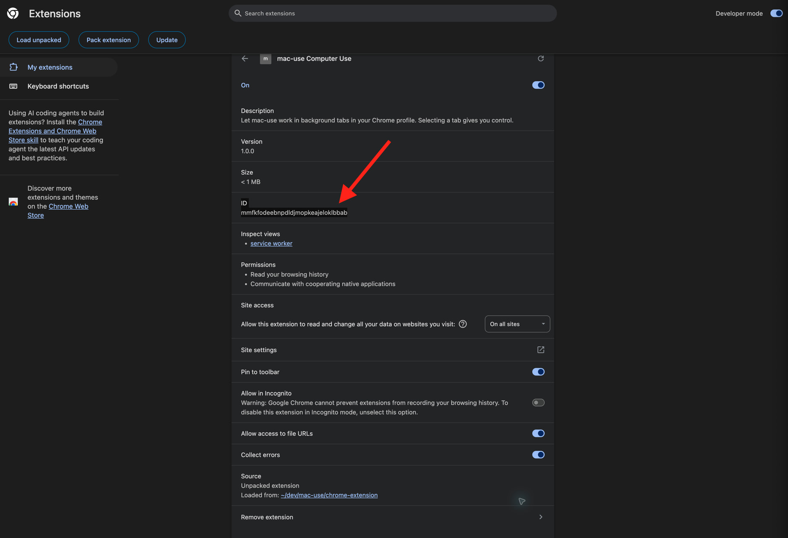

# mac-use

A macOS 14+ MCP server for controlling native macOS windows through Accessibility. An optional Chrome extension lets it work in new background tabs in your current Chrome profile.

[English](#english) | [Español](#español) | [Português (Brasil)](#português-brasil)

---

## English

### What you need

- macOS 14 or newer
- Xcode Command Line Tools (`xcode-select --install`)
- [Distill](https://github.com/samuelfaj/mac-use) installed and available in Terminal
- Google Chrome only if you want the browser tools

### 1. Build and connect the MCP server

Open Terminal and run:

```sh
git clone git@github.com:samuelfaj/mac-use.git
cd mac-use
swift build -c release
distill mcp add mac-use -- "$(pwd)/.build/release/mac-use-mcp"
distill mcp doctor mac-use
```

If you do not use GitHub SSH, replace the first command with the clone URL you normally use. Keep this folder in place after setup. Distill starts the server from the executable inside it. If Distill was already open, restart it after adding the server.

### 2. Allow macOS access for native windows

When macOS asks, allow **Accessibility** and **Screen Recording** for the app that runs Distill. These permissions are needed only for native macOS windows. You can use the MCP `doctor` tool on a window to check permissions.

### 3. Optional: set up Chrome

The Chrome extension is included in this repository. Load it into the same Chrome profile you plan to use with mac-use:

1. Open `chrome://extensions`.
2. Turn on **Developer mode**.
3. Click **Load unpacked** and select the `chrome-extension` folder inside the cloned `mac-use` folder.
4. Open the extension's details page and copy its 32-letter **ID**. The screenshot shows where to find it.

   

5. In Terminal, from the `mac-use` folder, register the extension with the native host. Replace the example ID with the one from your Chrome page:

   ```sh
   .build/release/mac-use-mcp install-chrome-host YOUR_32_LETTER_EXTENSION_ID
   ```

6. Click the mac-use extension icon in Chrome. Its badge should say **ON**. In Distill, call `browser_status`; it should report `connected: true`.

The extension uses Chrome's native messaging to connect to the MCP server. If you move the repository or reload the extension and its ID changes, run the registration command again with the new path or ID. Use a regular Chrome window, not Incognito.

### Try it

- For a native window, call `list_windows`, then use the returned exact window details with the relevant mac-use tools.
- For Chrome, call `browser_status`, then `browser_open` with an `http://` or `https://` address. It opens a new background tab. Use `browser_snapshot` to inspect it and `browser_act` for supported page actions.

`distill mcp doctor` checks that the MCP server starts and exposes its tools. It does not confirm macOS permissions or a Chrome connection.

### If Chrome says "Specified native messaging host not found"

The extension's native host registration is missing or does not match the extension ID. From the `mac-use` folder, run the registration command again with the current ID from `chrome://extensions`. Then click the extension icon to reconnect. Check that `.build/release/mac-use-mcp` is still at the same path and that the extension is loaded in the Chrome profile you are using.

### Privacy and control

The Chrome extension can read page text and form values, except password values. It can click, fill, type, and scroll in tabs that it opened. It does not automate your selected tab; selecting an automated tab gives control back to you. Page content and snapshots are visible to your Distill session, so do not use the browser tools on pages containing information you do not want to share with that session. The extension requests access to HTTP and HTTPS sites because it needs to operate on pages you ask it to open.

---

## Español

### Requisitos

- macOS 14 o posterior
- Xcode Command Line Tools (`xcode-select --install`)
- [Distill](https://github.com/samuelfaj/mac-use) instalado y disponible desde Terminal
- Google Chrome solo si quieres usar las herramientas del navegador

### 1. Compilar y conectar el servidor MCP

Abre Terminal y ejecuta:

```sh
git clone git@github.com:samuelfaj/mac-use.git
cd mac-use
swift build -c release
distill mcp add mac-use -- "$(pwd)/.build/release/mac-use-mcp"
distill mcp doctor mac-use
```

Si no usas SSH de GitHub, cambia el primer comando por la URL que utilizas normalmente. Conserva esta carpeta después de la instalación. Distill inicia el servidor desde el ejecutable que está dentro de ella. Si Distill ya estaba abierto, reinícialo después de añadir el servidor.

### 2. Permitir el acceso de macOS a las ventanas nativas

Cuando macOS lo solicite, permite **Accesibilidad** y **Grabación de pantalla** para la aplicación que ejecuta Distill. Estos permisos solo hacen falta para controlar ventanas nativas de macOS. Puedes usar la herramienta MCP `doctor` sobre una ventana para comprobar los permisos.

### 3. Opcional: configurar Chrome

La extensión de Chrome está incluida en este repositorio. Cárgala en el mismo perfil de Chrome que quieras usar con mac-use:

1. Abre `chrome://extensions`.
2. Activa el **Modo de desarrollador**.
3. Haz clic en **Cargar descomprimida** y selecciona la carpeta `chrome-extension` dentro de la carpeta clonada `mac-use`.
4. Abre los detalles de la extensión y copia su **ID** de 32 letras. La imagen indica dónde encontrarlo.

   

5. En Terminal, desde la carpeta `mac-use`, registra la extensión con el host nativo. Sustituye el ID de ejemplo por el que aparece en Chrome:

   ```sh
   .build/release/mac-use-mcp install-chrome-host ID_DE_32_LETRAS
   ```

6. Haz clic en el icono de mac-use en Chrome. El indicador debe mostrar **ON**. En Distill, llama a `browser_status`; la respuesta debe incluir `connected: true`.

La extensión usa la mensajería nativa de Chrome para conectarse al servidor MCP. Si mueves el repositorio o vuelves a cargar la extensión y cambia su ID, ejecuta otra vez el comando de registro con la ruta o el ID nuevos. Usa una ventana normal de Chrome, no el modo incógnito.

### Pruébalo

- Para una ventana nativa, llama a `list_windows` y usa los datos exactos de la ventana con las herramientas correspondientes de mac-use.
- Para Chrome, llama a `browser_status` y después a `browser_open` con una dirección `http://` o `https://`. Se abrirá una pestaña nueva en segundo plano. Usa `browser_snapshot` para verla y `browser_act` para realizar las acciones disponibles.

`distill mcp doctor` comprueba que el servidor MCP se inicia y ofrece sus herramientas. No comprueba los permisos de macOS ni la conexión con Chrome.

### Si Chrome muestra "Specified native messaging host not found"

Falta el registro del host nativo o el ID registrado no coincide con el de la extensión. Desde la carpeta `mac-use`, ejecuta de nuevo el comando de registro con el ID actual de `chrome://extensions`. Después, haz clic en el icono de la extensión para conectarla. Comprueba que `.build/release/mac-use-mcp` siga en la misma ruta y que la extensión esté cargada en el perfil de Chrome que estás usando.

### Privacidad y control

La extensión de Chrome puede leer el texto de las páginas y los valores de los formularios, excepto las contraseñas. Puede hacer clic, rellenar campos, escribir y desplazarse en las pestañas que abrió. No controla la pestaña seleccionada; si seleccionas una pestaña automatizada, recuperas el control. El contenido y las capturas de las páginas quedan visibles para tu sesión de Distill. No uses estas herramientas en páginas con información que no quieras compartir con esa sesión. La extensión solicita acceso a sitios HTTP y HTTPS para poder trabajar en las páginas que le pidas abrir.

---

## Português (Brasil)

### O que você precisa

- macOS 14 ou mais recente
- Xcode Command Line Tools (`xcode-select --install`)
- [Distill](https://github.com/samuelfaj/mac-use) instalado e disponível no Terminal
- Google Chrome somente se você quiser usar as ferramentas do navegador

### 1. Compile e conecte o servidor MCP

Abra o Terminal e execute:

```sh
git clone git@github.com:samuelfaj/mac-use.git
cd mac-use
swift build -c release
distill mcp add mac-use -- "$(pwd)/.build/release/mac-use-mcp"
distill mcp doctor mac-use
```

Se você não usa SSH do GitHub, substitua o primeiro comando pela URL que costuma usar. Mantenha essa pasta no mesmo lugar depois da instalação. O Distill inicia o servidor pelo executável que está dentro dela. Se o Distill já estiver aberto, reinicie-o depois de adicionar o servidor.

### 2. Permita o acesso do macOS às janelas nativas

Quando o macOS solicitar, permita **Acessibilidade** e **Gravação de Tela** para o aplicativo que inicia o Distill. Essas permissões são necessárias apenas para controlar janelas nativas do macOS. Você pode usar a ferramenta MCP `doctor` em uma janela para verificar as permissões.

### 3. Opcional: configure o Chrome

A extensão do Chrome está incluída neste repositório. Carregue-a no mesmo perfil do Chrome que pretende usar com o mac-use:

1. Abra `chrome://extensions`.
2. Ative o **Modo do desenvolvedor**.
3. Clique em **Carregar sem compactação** e selecione a pasta `chrome-extension` dentro da pasta clonada `mac-use`.
4. Abra os detalhes da extensão e copie o **ID** de 32 letras. A imagem mostra onde encontrá-lo.

   

5. No Terminal, dentro da pasta `mac-use`, registre a extensão com o host nativo. Troque o ID de exemplo pelo ID exibido no Chrome:

   ```sh
   .build/release/mac-use-mcp install-chrome-host SEU_ID_DE_32_LETRAS
   ```

6. Clique no ícone da extensão mac-use no Chrome. O indicador deve mostrar **ON**. No Distill, chame `browser_status`; a resposta deve incluir `connected: true`.

A extensão usa o sistema de mensagens nativas do Chrome para se conectar ao servidor MCP. Se você mover o repositório ou recarregar a extensão e o ID mudar, execute novamente o comando de registro com o caminho ou ID atualizado. Use uma janela normal do Chrome, não o modo anônimo.

### Teste

- Para uma janela nativa, chame `list_windows` e use os dados exatos da janela com as ferramentas correspondentes do mac-use.
- Para o Chrome, chame `browser_status` e depois `browser_open` com um endereço `http://` ou `https://`. Uma nova aba será aberta em segundo plano. Use `browser_snapshot` para conferir a página e `browser_act` para executar as ações disponíveis.

`distill mcp doctor` verifica se o servidor MCP inicia e disponibiliza as ferramentas. Ele não verifica as permissões do macOS nem a conexão com o Chrome.

### Se o Chrome mostrar "Specified native messaging host not found"

O registro do host nativo está ausente ou não corresponde ao ID da extensão. Na pasta `mac-use`, execute novamente o comando de registro com o ID atual de `chrome://extensions`. Depois, clique no ícone da extensão para conectar. Confira se `.build/release/mac-use-mcp` continua no mesmo caminho e se a extensão está carregada no perfil do Chrome que você está usando.

### Privacidade e controle

A extensão do Chrome pode ler o texto das páginas e os valores dos formulários, exceto senhas. Ela pode clicar, preencher campos, digitar e rolar em abas que abriu. Ela não controla a aba selecionada; ao selecionar uma aba automatizada, você retoma o controle. O conteúdo e as capturas das páginas ficam visíveis para a sessão do Distill. Não use essas ferramentas em páginas com informações que você não queira compartilhar com essa sessão. A extensão solicita acesso a sites HTTP e HTTPS para poder operar nas páginas que você pedir para abrir.
